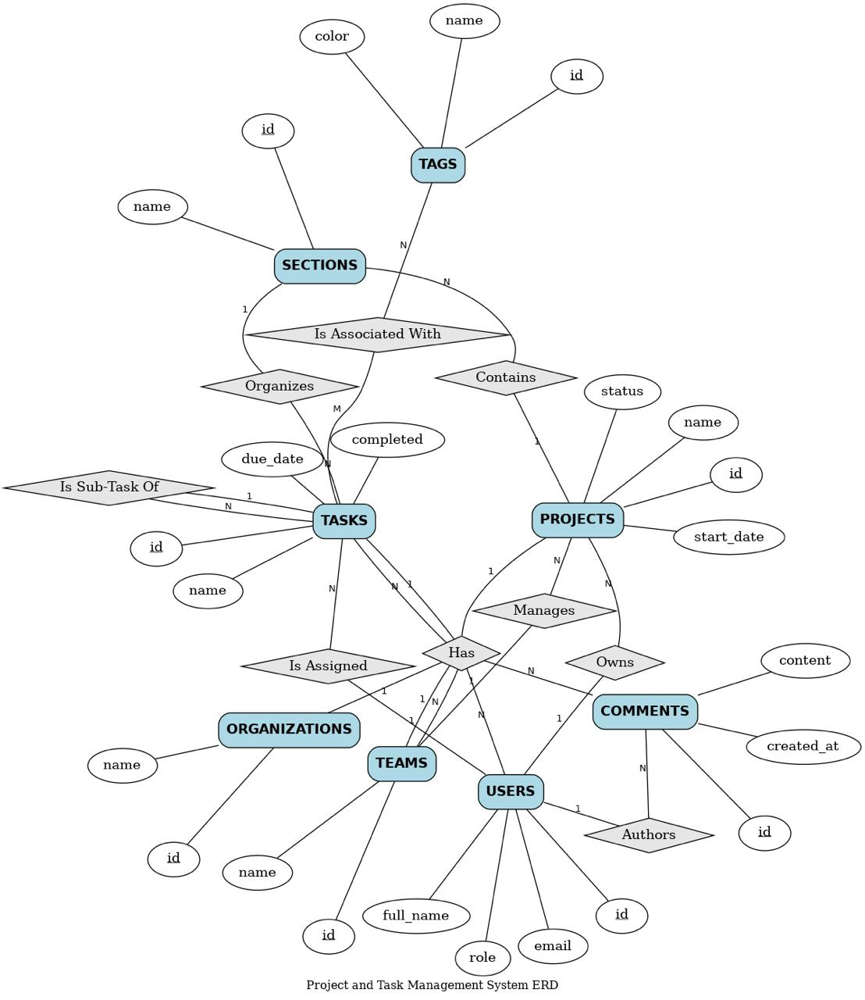

# Asana Enterprise Simulation Dataset Generator

## Project Overview

This project generates a highly realistic synthetic dataset simulating a large B2B SaaS organization's usage of Asana. The dataset is stored in a SQLite database and models a company with 5,000–10,000 employees, spanning engineering, marketing, and operations teams.

The schema and data generation are designed to closely mirror real Asana data structures and usage patterns, including:

- Hierarchical tasks (subtasks via self-referential foreign key)
- Project-specific custom fields
- Sections (columns/boards)
- Tags, comments, and team memberships
- Temporal and relational consistency

This makes the dataset particularly suitable for training and evaluating reinforcement learning (RL) agents in complex, multi-step enterprise workflows, without exploitable artifacts or shortcuts.

### Published Dataset

The generated dataset is publicly available on Kaggle:

🔗 **Asana Enterprise Workspace Simulation Dataset**  
<https://www.kaggle.com/datasets/dnkumars/asana-enterprise-workspace-simulation-dataset/data>

The Kaggle release includes:

- `finaldb.sqlite` (authoritative relational database)
- CSV exports for each table (for visibility and EDA)
- Dataset documentation and provenance details

### Motivation

Real-world Asana data is proprietary and inaccessible. This project provides a high-fidelity, ethically generated alternative that avoids simplistic synthetic artifacts while enabling meaningful evaluation of AI agents in enterprise settings.

## Key Features

- **Realism Grounded in Real-World Sources**: Names, distributions, and patterns derived from public data (e.g., Crunchbase, GitHub issues, Asana reports).
- **Strict Consistency**: Enforced temporal logic (e.g., `completed_at > created_at`), referential integrity, and business rules (e.g., subtasks inherit project).
- **Hybrid Content Generation**: Selective use of LLMs for natural task titles/descriptions, with heuristic fallbacks for scale and control.
- **Scalable Configuration**: Adjustable via environment variables (e.g., user count, project count).

## ER Diagram Reference




*(An ER diagram visualizing relationships between organizations, teams, users, projects, sections, tasks, comments, custom fields, and tags.)*

## Database Schema

### Database Overview

**Database:** `output/finaldb.sqlite`  
**Tables found:** 9

---

#### Table: `comments`

| id | task_id | author_id | content | created_at |
|---|---|---|---|---|
| a2936b9a-982f-4b41-a0e2-36f2c8295442 | 48695218-45c7-4d7b-9fc7-e0b872db46f4 | cabcd787-74a4-4d74-83e3-e561d40fc77d | Initial refactor completed. Error responses are now standardized. Pending review after load testing. | 2024-10-15T11:20:00 |
| f385187f-1028-45c1-8212-1d633afee1c0 | 48695218-45c7-4d7b-9fc7-e0b872db46f4 | 97e1d9f3-0224-4258-8905-5c58a7c8f042 | Looks good! The structured logging will help a lot with debugging. Approved. | 2024-10-17T09:45:00 |
| 35e92ce6-4d29-4dee-862d-95581e2e6862 | 48695218-45c7-4d7b-9fc7-e0b872db46f4 | cabcd787-74a4-4d74-83e3-e561d40fc77d | Merged to main. Deployed to production. | 2024-10-18T16:30:00 |
| 97344e7c-a290-4e89-a435-7c09349e5544 | a129bc5e-4e99-4936-bc1d-4f47d16b502f | e1497f4f-d66c-4a2a-80f6-cbfcdfee7c99 | Started investigation. Current pool size seems suboptimal during peak load. | 2024-10-16T10:15:00 |

---

#### Table: `organizations`

| id | name |
|---|---|
| 1f3d6666-a183-4754-9cff-fc230809983c | Acme Systems |
| 76b2c7e4-798b-4403-8181-fbad72f4610f | TechFlow Industries |
| ef934e7b-4215-4f6d-93e3-5407a8425380 | DataStream Solutions |
| 8b59b103-5cff-45a8-b7a6-21f132f3e204 | CloudNexus Corp |

---

#### Table: `projects`

| id | name | description | team_id | owner_id | start_date | end_date | status |
|---|---|---|---|---|---|---|---|
| 075354a5-7a0a-4adf-8c78-0e3c18c88324 | Platform Stability Q4 | Improve reliability, performance, and observability of core backend services. | e8820255-60bf-490b-80d2-65240a9a7286 | cabcd787-74a4-4d74-83e3-e561d40fc77d | 2024-10-01 | 2024-12-31 | active |
| 5b5653db-f483-4788-a2d9-0ecdd47f2615 | API v3 Migration | Migrate all endpoints from API v2 to v3 with backward compatibility. | e8820255-60bf-490b-80d2-65240a9a7286 | cac3b087-6987-4016-bc1d-53de0d26fc5c | 2024-09-15 | 2025-01-15 | active |
| 9b251c03-ad3a-4c26-8a95-6e3b165873f3 | Database Optimization Sprint | Optimize database queries and implement caching strategies. | e8820255-60bf-490b-80d2-65240a9a7286 | 97e1d9f3-0224-4258-8905-5c58a7c8f042 | 2024-11-01 | 2024-12-15 | active |
| 62f7a4a7-f7a4-4607-841c-a0c671200b9f | Dashboard Redesign | Complete redesign of the main user dashboard with improved UX. | 80cdd123-7cb1-4275-b158-fcd52d5e8aa2 | 133866d6-219d-4a0b-9b06-790911a11dae | 2024-10-05 | 2024-12-20 | active |

---

#### Table: `sections`

| id | name | project_id |
|---|---|---|
| b0efab02-62d3-4a4b-9551-0053aa614345 | In Progress | 075354a5-7a0a-4adf-8c78-0e3c18c88324 |
| b7168707-9eac-4f71-a2d3-ac3605cb117a | Code Review | 075354a5-7a0a-4adf-8c78-0e3c18c88324 |
| 48d2defe-70e5-4623-8559-ee71764bd275 | Done | 075354a5-7a0a-4adf-8c78-0e3c18c88324 |
| d3fe64d8-249e-46c3-8813-45a3beaee50a | Backlog | 5b5653db-f483-4788-a2d9-0ecdd47f2615 |

---

#### Table: `tags`

| id | name | color | created_at |
|---|---|---|---|
| 9883816c-0133-4c43-b838-071884250825 | High Priority | red | 2024-10-01T08:00:00 |
| 626e824b-9ec0-42c1-a5fc-4d6ee58fe262 | Bug | orange | 2024-10-01T08:00:00 |
| a5bca665-781a-48ac-bd9f-da5392217598 | Feature | blue | 2024-10-01T08:00:00 |
| 20dc9d90-524f-4c1a-a39e-7acaeeeaabca | Technical Debt | yellow | 2024-10-01T08:00:00 |

---

#### Table: `task_tags`

| task_id | tag_id |
|---|---|
| 48695218-45c7-4d7b-9fc7-e0b872db46f4 | 9883816c-0133-4c43-b838-071884250825 |
| 35352ab8-53e0-423a-9507--7f3216099af2 | 9883816c-0133-4c43-b838-071884250825 |
| c5585a13-cad7-444b-8e1c-ac35b99f5b93 | 9883816c-0133-4c43-b838-071884250825 |
| 8e37bcaf-703f-4d20-90b4-db0e6ae3480f | 9883816c-0133-4c43-b838-071884250825 |

---

#### Table: `tasks`

| id | name | description | project_id | section_id | assignee_id | parent_task_id | created_at | due_date | completed | completed_at |
|---|---|---|---|---|---|---|---|---|---:|---|
| 48695218-45c7-4d7b-9fc7-e0b872db46f4 | API Gateway - Refactor - Error handling | Refactor the API Gateway error-handling logic to improve consistency and observability.<br>- Normalize error responses<br>- Add structured logging<br>- Update unit tests | 075354a5-7a0a-4adf-8c78-0e3c18c88324 | 48d2defe-70e5-4623-8559-ee71764bd275 | cabcd787-74a4-4d74-83e3-e561d40fc77d | None | 2024-10-10T09:30:00 | 2024-10-20 | 1 | 2024-10-18T16:45:00 |
| a129bc5e-4e99-4936-bc1d-4f47d16b502f | Database - Optimize - Connection pooling | Optimize database connection pooling configuration for better resource utilization. | 075354a5-7a0a-4adf-8c78-0e3c18c88324 | b0efab02-62d3-4a4b-9551-0053aa614345 | e1497f4f-d66c-4a2a-80f6-cbfcdfee7c99 | None | 2024-10-15T10:00:00 | 2024-11-05 | 0 | None |
| 35352ab8-53e0-423a-9507-7f3216099af2 | Auth Service - Implement - Rate limiting | Add rate limiting to authentication endpoints to prevent brute force attacks. | 075354a5-7a0a-4adf-8c78-0e3c18c88324 | b7168707-9eac-4f71-a2d3-ac3605cb117a | 97e1d9f3-0224-4258-8905-5c58a7c8f042 | None | 2024-10-12T11:15:00 | 2024-10-30 | 0 | None |
| 85e7e47d-18b5-4749-a568-68f50a82ce75 | Monitoring - Add - Custom metrics | Implement custom business metrics for better observability. | 075354a5-7a0a-4adf-8c78-0e3c18c88324 | b0efab02-62d3-4a4b-9551-0053aa614345 | 1246f764-9c07-4e3f-8175-4c36d6a26714 | None | 2024-10-18T09:00:00 | 2024-11-10 | 0 | None |

---

#### Table: `teams`

| id | name | organization_id |
|---|---|---|
| e8820255-60bf-490b-80d2-65240a9a7286 | Backend Engineering | 1f3d6666-a183-4754-9cff-fc230809983c |
| 80cdd123-7cb1-4275-b158-fcd52d5e8aa2 | Frontend Engineering | 1f3d6666-a183-4754-9cff-fc230809983c |
| b65de153-ae71-4a44-b822-7f207a017835 | DevOps | 1f3d6666-a183-4754-9cff-fc230809983c |
| fcd2cdf7-89df-4aa0-a764-22fdc1c0909a | Product Management | 76b2c7e4-798b-4403--8181-fbad72f4610f |

---

#### Table: `users`

| id | full_name | email | role | team_id | joined_at |
|---|---|---|---|---|---|
| cabcd787-74a4-4d74-83e3-e561d40fc77d | Aarav Patel | [aarav.patel@acmesystems.com](mailto:aarav.patel@acmesystems.com) | Senior Backend Engineer | e8820255-60bf-490b-80d2-65240a9a7286 | 2024-07-15T10:00:00 |
| e1497f4f-d66c-4a2a-80f6-cbfcdfee7c99 | Sofia Martinez | [sofia.martinez@acmesystems.com](mailto:sofia.martinez@acmesystems.com) | Backend Engineer | e8820255-60bf-490b-80d2-65240a9a7286 | 2024-08-01T09:00:00 |
| 97e1d9f3-0224-4258-8905-5c58a7c8f042 | Chen Wei | [chen.wei@acmesystems.com](mailto:chen.wei@acmesystems.com) | Staff Engineer | e8820255-60bf-490b-80d2-65240a9a7286 | 2024-06-10T08:30:00 |
| 1246f764-9c07-4e3f-8175-4c36d6a26714 | Priya Sharma | [priya.sharma@acmesystems.com](mailto:priya.sharma@acmesystems.com) | Backend Engineer | e8820255-60bf-490b-80d2-65240a9a7286 | 2024-09-05T10:15:00 |


### Detailed Tables

(See **Section A: Database Schema** in the provided documentation for full table definitions, columns, constraints, and relationships.)

**Key design decisions:**
- UUIDs for all IDs (mirroring Asana GIDs).
- Self-referential `parent_task_id` in `tasks` for unlimited subtask nesting.
- Separate tables for custom field definitions (project-scoped) and values.
- Global reusable tags with many-to-many task associations.

The schema faithfully represents Asana's data model, including project-specific custom fields, sections as task groupings, and threaded comments.

## Data Generation Methodology

### Methodological Foundations (Section B Continued)

- Grounded in scraped/real-world sources for names, projects, and tasks.
- Empirical distributions from productivity research (e.g., Asana Anatomy of Work reports).
- Selective LLM usage for varied, natural language content.
- Strict temporal and relational guarantees.

### Seed Data Strategy (Section B)

Column-by-column breakdown of generation strategies, sources, and justifications for each table (organizations, teams, users, projects, tasks, etc.).

**Highlights:**
- Task completion rates: Engineering ~70–85%, Marketing ~55–65%, Operations ~40–50%.
- Due date distributions: Realistic horizons with weekday bias and overdue cases.
- Task naming patterns: Enforced conventions (e.g., `[Component] - [Action] - [Detail]` for engineering).

## Prerequisites

- Python 3.8+
- Required packages:

```bash
pip install faker openai python-dotenv pandas
```


## Environment Configuration

Create a `.env` file in the project root directory with the following content:

```dotenv
OPENAI_API_KEY=your_api_key_here          # Required for LLM-based task generation (optional if using heuristic-only mode)
COMPANY_NAME=Acme SaaS Inc                # Name of the simulated organization
TOTAL_USERS=6000                          # Target number of users (recommended: 5000–10000)
TOTAL_PROJECTS=1200                       # Target number of projects
DB_PATH=output/asana_simulation.sqlite     # Path to the output SQLite database
```

You can add additional optional variables as needed (e.g., for controlling LLM temperature, seed, etc.).

## How to Run

1. Activate your Python virtual environment (if using one).

2. Navigate to the project root directory:

```bash
cd /path/to/asana-seed-data
```

   Example (as in your setup):

```bash
cd D:\Office\Project\AIML PRO\MY PRO\Scalar Assignment\asana-seed-data
```

3. Run the generator:

```bash
python -m src.main
```

**What happens when you run it:**

- Loads environment variables
- Creates the SQLite database and schema
- Sequentially populates all tables with consistent synthetic data
- Uses OpenAI (if API key provided) selectively for realistic task titles and descriptions
- Prints progress logs and final database location

Generation time varies with scale and LLM usage (typically several hours for large datasets).

The resulting database file (`asana_simulation.sqlite` by default) can be opened with any SQLite viewer (e.g., DB Browser for SQLite) or used directly in downstream applications or RL environments.

## Output

- A single SQLite database file at the path specified by `DB_PATH`.
- Fully populated with realistic, relationally consistent data ready for analysis, querying, or agent training.

## Notes

- All constraints are strictly enforced to prevent invalid states that RL agents could exploit.
- LLM usage is limited for cost control; you can adjust the proportion or disable it in the code if preferred.
- The generation logic is modular and lives in the `src/` directory — easy to extend or customize.

This dataset provides a robust, enterprise-scale simulation of Asana, ideal for advanced AI research and development.

**Enjoy!**