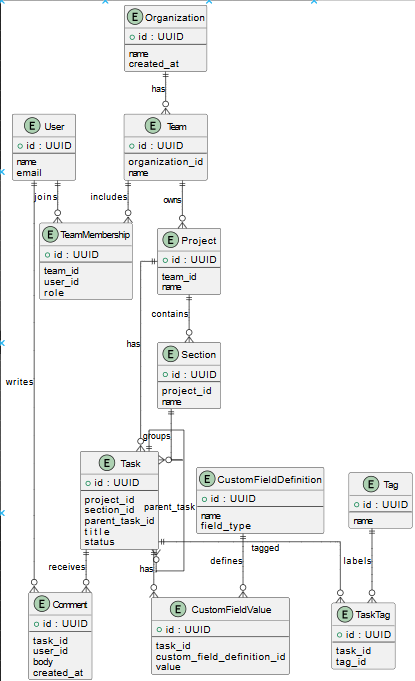

# Section A: Database Schema

## Overview

The schema models a large B2B SaaS organization (5,000–10,000 employees) using Asana for product development, marketing, and operations. The design emphasizes:

- Relational integrity
- Temporal consistency
- Flexibility for custom fields
- Support for hierarchical tasks
- Scalability to enterprise usage patterns

All identifiers use UUIDs to mirror Asana’s globally unique GID-style identifiers.

## 1. Tables and Relationships (Schema Flow)
### ER Diagram

### 1.1 Organizations / Workspaces

Represents the top-level Asana organization.

**organizations**

| Column          | Type                  | Constraints                  |
|-----------------|-----------------------|------------------------------|
| id              | TEXT (UUID)           | PK                           |
| name            | TEXT                  |                              |
| email_domain    | TEXT                  |                              |
| created_at      | TIMESTAMP             |                              |

**Relationships**
- One organization → many teams
- One organization → many users
- One organization → many projects

### 1.2 Teams

Logical groupings of users within an organization.

**teams**

| Column          | Type                  | Constraints                  |
|-----------------|-----------------------|------------------------------|
| id              | TEXT (UUID)           | PK                           |
| organization_id | TEXT                  | FK → organizations.id        |
| name            | TEXT                  |                              |
| created_at      | TIMESTAMP             |                              |

**Relationships**
- Many teams → one organization
- Many teams ↔ many users (via team_memberships)
- One team → many projects

### 1.3 Users

Represents individual employees.

**users**

| Column          | Type                  | Constraints                  |
|-----------------|-----------------------|------------------------------|
| id              | TEXT (UUID)           | PK                           |
| organization_id | TEXT                  | FK → organizations.id        |
| email           | TEXT                  | UNIQUE                       |
| full_name       | TEXT                  |                              |
| role            | TEXT                  |                              |
| created_at      | TIMESTAMP             |                              |

**Relationships**
- Many users → one organization
- Many users ↔ many teams
- One user → many assigned tasks
- One user → many comments

### 1.4 Team Memberships

Many-to-many relationship between users and teams.

**team_memberships**

| Column     | Type      | Constraints                          |
|------------|-----------|--------------------------------------|
| team_id    | TEXT      | FK → teams.id                        |
| user_id    | TEXT      | FK → users.id                        |
| joined_at  | TIMESTAMP |                                      |

**PRIMARY KEY** (team_id, user_id)

**Rationale**  
Supports users belonging to multiple teams (common in large orgs).

### 1.5 Projects

Collections of tasks organized around initiatives.

**projects**

| Column          | Type                  | Constraints                  |
|-----------------|-----------------------|------------------------------|
| id              | TEXT (UUID)           | PK                           |
| organization_id | TEXT                  | FK → organizations.id        |
| team_id         | TEXT                  | FK → teams.id                |
| name            | TEXT                  |                              |
| type            | TEXT                  | (engineering, marketing, operations) |
| status          | TEXT                  |                              |
| start_date      | DATE                  |                              |
| end_date        | DATE                  |                              |
| created_at      | TIMESTAMP             |                              |

**Relationships**
- One project → many sections
- One project → many tasks
- One project → many custom field definitions

### 1.6 Sections

Subdivisions within a project (e.g., “Backlog”, “In Progress”).

**sections**

| Column      | Type      | Constraints                  |
|-------------|-----------|------------------------------|
| id          | TEXT (UUID) | PK                         |
| project_id  | TEXT      | FK → projects.id             |
| name        | TEXT      |                              |
| position    | INTEGER   |                              |

**Relationships**
- Many sections → one project
- One section → many tasks

### 1.7 Tasks

The fundamental unit of work.

**tasks**

| Column           | Type                  | Constraints                          |
|------------------|-----------------------|--------------------------------------|
| id               | TEXT (UUID)           | PK                                   |
| name             | TEXT                  |                                      |
| description      | TEXT                  |                                      |
| project_id       | TEXT                  | FK → projects.id                     |
| section_id       | TEXT                  | FK → sections.id                     |
| assignee_id      | TEXT                  | FK → users.id, NULLABLE              |
| parent_task_id   | TEXT                  | FK → tasks.id, NULLABLE              |
| created_at       | TIMESTAMP             |                                      |
| due_date         | DATE                  | NULLABLE                             |
| completed        | BOOLEAN               |                                      |
| completed_at     | TIMESTAMP             | NULLABLE                             |

**Relationships**
- Many tasks → one project
- Many tasks → one section
- Tasks may reference another task (hierarchy)
- One task → many comments
- One task → many tags
- One task → many custom field values

### 1.8 Subtasks (Task Hierarchy)

**Design Choice:** Subtasks are represented using a self-referential foreign key.

`tasks.parent_task_id → tasks.id`

**Rationale**
- Avoids a separate subtasks table
- Allows unlimited nesting depth
- Matches how Asana models subtasks internally
- Simplifies querying parent/child relationships

### 1.9 Comments (Stories)

Represents discussions and activity on tasks.

**comments**

| Column             | Type                  | Constraints                          |
|--------------------|-----------------------|--------------------------------------|
| id                 | TEXT (UUID)           | PK                                   |
| task_id            | TEXT                  | FK → tasks.id                        |
| author_id          | TEXT                  | FK → users.id                        |
| body               | TEXT                  |                                      |
| created_at         | TIMESTAMP             |                                      |
| parent_comment_id  | TEXT                  | FK → comments.id, NULLABLE           |

**Relationships**
- Many comments → one task
- Self-referential for threaded discussions

### 1.10 Custom Field Definitions

Defines project-specific metadata fields.

**custom_field_definitions**

| Column      | Type                  | Constraints                  |
|-------------|-----------------------|------------------------------|
| id          | TEXT (UUID)           | PK                           |
| project_id  | TEXT                  | FK → projects.id             |
| name        | TEXT                  |                              |
| field_type  | TEXT                  | enum: text, number, enum     |
| created_at  | TIMESTAMP             |                              |

### 1.11 Custom Field Values

Stores values for each task’s custom fields.

**custom_field_values**

| Column           | Type      | Constraints                          |
|------------------|-----------|--------------------------------------|
| task_id          | TEXT      | FK → tasks.id                        |
| custom_field_id  | TEXT      | FK → custom_field_definitions.id     |
| value            | TEXT      |                                      |

**PRIMARY KEY** (task_id, custom_field_id)

### 1.12 Tags

Reusable labels across projects.

**tags**

| Column      | Type      | Constraints      |
|-------------|-----------|------------------|
| id          | TEXT (UUID) | PK             |
| name        | TEXT      |                  |
| created_at  | TIMESTAMP |                  |

### 1.13 Task–Tag Associations

Many-to-many mapping between tasks and tags.

**task_tags**

| Column   | Type | Constraints              |
|----------|------|--------------------------|
| task_id  | TEXT | FK → tasks.id            |
| tag_id   | TEXT | FK → tags.id             |

**PRIMARY KEY** (task_id, tag_id)

### ER Diagram

## 2. Design Decisions

### 2.1 Handling Custom Fields (Project-Specific Variability)

**Problem**  
Custom fields vary by project and cannot be statically defined in the tasks table.

**Solution**
- Separate `custom_field_definitions` from `custom_field_values`
- Definitions are scoped to projects
- Values are stored per task

**Benefits**
- Fully flexible schema
- Supports different fields per project
- Mirrors Asana’s real data model
- Avoids sparse columns or schema changes

### 2.2 Representing Task Hierarchy (Tasks vs. Subtasks)

**Problem**  
Tasks can have subtasks, which themselves can have further subtasks.

**Solution**
- Single `tasks` table
- Self-referential foreign key (`parent_task_id`)

**Benefits**
- Unlimited nesting
- No duplication of logic
- Easy traversal for RL environments
- Matches real-world Asana behavior

## 3. Why This Schema Is Suitable for an RL Environment

- Preserves realistic relational complexity
- Enables multi-step workflows (navigate org → team → project → section → task)
- Supports temporal reasoning
- Allows stateful interactions (comments, completion, tagging)
- Avoids shortcuts that models could exploit